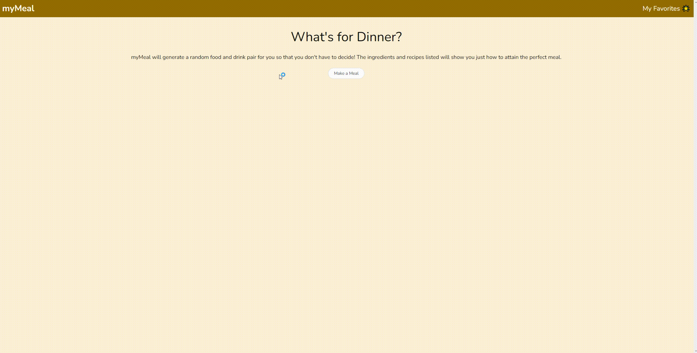

# myMeal 

## Description

This was the first project in phase 1 of the coding bootcamp. We were tasked to work collabortively with a group to create an interactive front-end application. Our group worked together to come up with an idea to solve a common problem we all face: not knowing what to eat. 

Technologies used:
- 2 server-side APis (mealDB and cocktailDB)
- Bulma CSS framework
- JavaScript
- HTML
- Client-side storage to store persistent data
- Google fonts

## Webpage Access
 - Github Repository (https://github.com/b-locatelli/myMeal-Generator)
 - Deployed Webpage (https://b-locatelli.github.io/myMeal-Generator/)

## Image of Webpage

